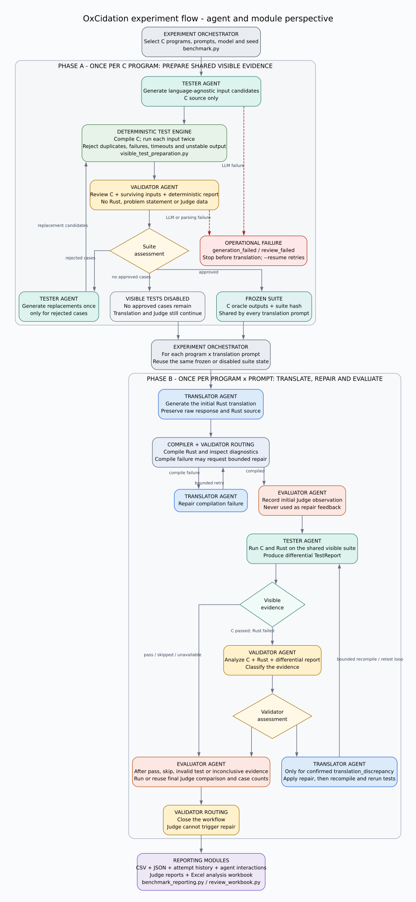

# Experiment Agent Flow

This diagram presents the implemented experiment from the perspective of its
agents and supporting modules. Read it from top to bottom.

## How to Read It

- **Phase A runs once per C program.** The Tester generates visible inputs, the
  deterministic engine filters them, and the Validator reviews each candidate.
  Approved cases are preserved, and only rejected cases may receive one
  replacement round before the resulting suite is frozen for every prompt.
- **Phase B runs once per program and prompt.** The Translator produces Rust,
  the Tester compares C and Rust, and the Validator permits repair only when a
  translation discrepancy is confirmed.
- **The Evaluator owns Judge execution.** Initial and final Judge results are
  observational and never return to the Translator.
- **Gray routing and execution boxes are deterministic.** Colored agent boxes
  identify where the configured LLM or an agent-specific operation participates.

The editable diagram source is
[`assets/experiment-agent-flow.dot`](assets/experiment-agent-flow.dot). PNG and
SVG exports are kept beside it for documents and presentations.
