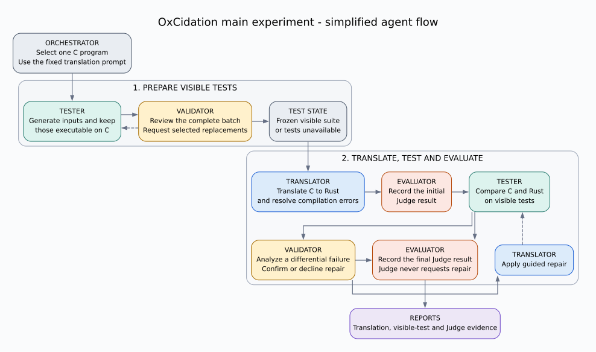

# Simplified Main Experiment Flow

This diagram follows one C program through the main experiment after the
translation prompt has already been selected and fixed. It omits implementation
files, hashes, detailed error categories, and operational failure branches.

The visible-test suite is prepared once before translation. Executable cases
are preserved, the complete batch is reviewed, and only requested slots are
replaced. The frozen suite is then reused. Only a confirmed visible-test
translation discrepancy can guide a Rust repair. Judge results never enter the
repair loop.

The [detailed benchmark flow](08-experiment-agent-flow.md) additionally shows
how each program is combined with every candidate prompt during prompt
selection, along with implementation boundaries and terminal states.

The editable source is
[`assets/experiment-agent-flow-simple.dot`](assets/experiment-agent-flow-simple.dot).
